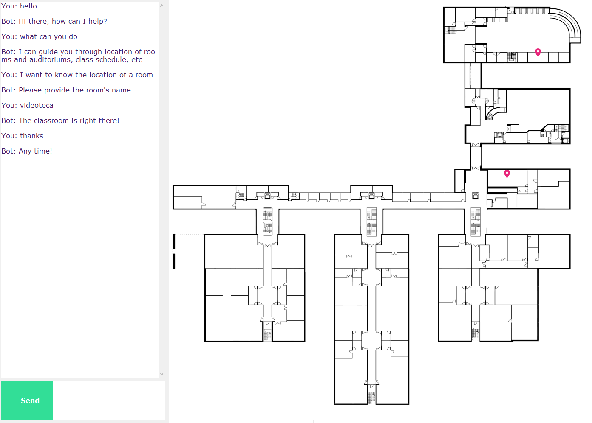

<!-- PROJECT LOGO -->
 

  

  <h3 align="center">IPBot</h3>

  

    Assistant robot
  

<!-- ABOUT THE PROJECT -->
## About The Project

  
  
  [Youtube Demo](https://youtu.be/gOLF7uMMAAM)

This is a conversation module for a assistant robot in the Polytechnic Institute of Bragança.

### Features

* Chatbot
* Class schedule
* Location module
* Voice recognition
* Frequently asked questions
* GUI

### Built With

* [Python 3.6](https://www.python.org)
* [TensorFlow](https://www.tensorflow.org)
* [Keras](https://keras.io)
* [Natural Language Toolkit](https://www.nltk.org)
* [Google Cloud Speech API](https://cloud.google.com/speech-to-text)
* [Tkinter](https://docs.python.org/3/library/tkinter.html)
* [SQLite](https://www.sqlite.org/index.html)

<!-- CONTACT -->
## Contact

Milton Boos Junior - miltonboosj@gmail.com

Project Link: [https://github.com/juniorboos/ChatbotIPB](https://github.com/juniorboos/ChatbotIPB)

